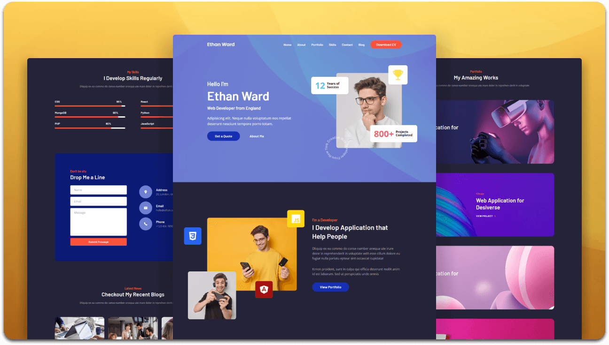

  <h2 align="center">Aymen Hannani — Personal Portfolio Website</h2>

  Portfolio of **Aymen Hannani**, Data Engineer &amp; BI Consultant | Product Owner Data &amp; BI, based in Casablanca, Morocco.  
  Fully responsive, built using HTML, CSS, and JavaScript.

 

### About

Data and BI professional with 7+ years of experience spanning data engineering, business
intelligence, data modeling, and product ownership. Microsoft PL-300 certified, with expertise in
Power BI, Microsoft Fabric, SQL, and Python. Trilingual (Arabic, French, English).

### Demo Screeshots

### Prerequisites

Before you begin, ensure you have met the following requirements:

* [Git](https://git-scm.com/downloads "Download Git") must be installed on your operating system.

### Run Locally

The site is a static page — clone the repository and open `index.html` in your browser, or serve
the folder with any static web server.

### Contact

* Email: [aymenhannani@gmail.com](mailto:aymenhannani@gmail.com)
* Phone: +212 615 148254
* LinkedIn: [linkedin.com/in/aymen-hannani](https://linkedin.com/in/aymen-hannani)
* Location: Casablanca, Morocco

### Credits

Base HTML/CSS template by [codewithsadee](https://github.com/codewithsadee/portfolio).

### License

This project is **free to use** and does not contains any license.
